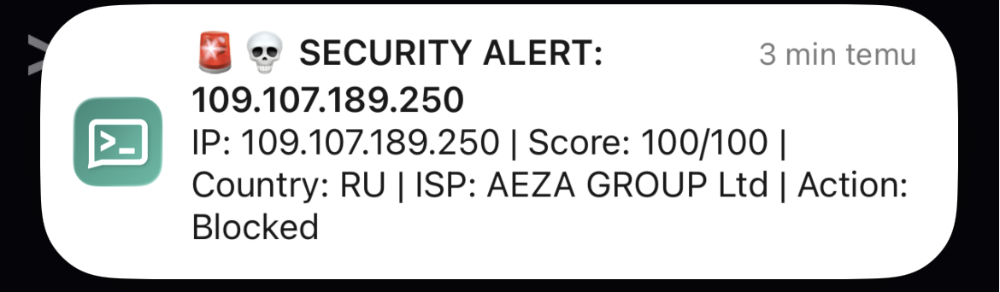

# Automated Incident Response


SecOps utility designed to bridge the gap between detection (**Fail2Ban**) and decision-making. It acts as a custom action trigger that enriches incident data via Threat Intelligence provider (**AbuseIPDB**) and alerts (**Ntfy**) administrators in real-time.

## Incident Lifecycle
```
[ Attacker ]
     │
     │ SSH brute-force attempts
     ▼
[ sshd ]
     │
     │ Writes logs
     ▼
[ /var/log/auth.log ]
     │
     │ Log pattern match
     ▼
[ Fail2Ban ]
     │
     │ Detects brute-force
     │ Applies temporary ban (iptables)
     │ Triggers custom action
     ▼
[ main.py ] (Entrypoint)
     │
     │ Passes incident context (IP, service, retries)
     ▼
[ core.py ] (Decision Engine)
     │
     ├──▶ [ intel.py ]
     │         │ Queries AbuseIPDB
     │         │ Returns reputation data
     │
     ├── Evaluates severity
     │   Decides on permanent ban / alert
     ▼
[ notifier.py ]
     │
     │ Sends notification
     ▼
[ ntfy.sh ]
     │
     ▼
[ Admin / User ]
```

## See it in Action
Received alerts directly on your mobile device via the Ntfy app:

<p align="center">
  
</p>

## Scope & Responsibilities
- **Detection:** Handled by Fail2Ban (log parsing).
- **Enrichment:** Handled by `intel.py` (AbuseIPDB API).
- **Decision:** Handled by `core.py` based on `critical_score` threshold (0-100).
Alerts are triggered when `score >= threshold` (default: 50), indicating potentially malicious IPs.
- **Alerting:** Handled by `notifier.py` (Ntfy push notifications).
- **Logging:** Handled by `logger.py`. All events are recorded for audit.

## Installation & Setup
1. **Clone the repository:**
```bash
git clone https://github.com/tiltaslifestyle/automated-incident-response.git
cd automated-incident-response
```

2. **Install dependencies:**
```bash
pip3 install -r requirements.txt
```

3. **Configuration:** Copy the example configuration and add your API key and Ntfy Topic.
```bash
cp config/settings.yaml.example config/settings.yaml
```
*AbuseIPDB Key: Get it [here](https://www.abuseipdb.com/)*<br>
*Ntfy Topic: Choose a unique topic name (e.g., my-alerts-999)*

## Usage (Manual Mode)
You can run the tool manually to analyze specific IPs without waiting for an attack.
```bash
# Analyze a suspicious IP
python3 src/main.py 109.107.189.250
```
*Output: If the IP is malicious, you will receive a push notification.*

## Observability & Logs
Every execution is audited. Check `automated-incident-response.log` to see the decision flow:

```text
2025-12-26 14:00:01 - INFO - [main] - Config loaded. Starting analysis...
2025-12-26 14:00:01 - INFO - [core] - Engine: Analyzing 118.25.6.39...
2025-12-26 14:00:02 - INFO - [core] - Report: Score 100/100 | Country: CN
2025-12-26 14:00:02 - INFO - [core] - Alert sent successfully.
```

## Fail2Ban Integration
To use this tool as an automated response action:

**Step 1: Create the Action Definition**
Create a new file `/etc/fail2ban/action.d/automated-incident-response.conf`:

```ini
[Definition]
# Description: Call our Python script with the banned IP
actionban = /usr/bin/python3 /path/to/automated-incident-response/src/main.py <ip>

# No action needed on unban
actionunban = 
```

**Step 2: Enable in Jail**
Edit your `/etc/fail2ban/jail.local` to use the new action for SSH (or other jails):

```ini
[sshd]
enabled = true
port    = ssh
logpath = /var/log/auth.log
maxretry = 3
# Add our custom action alongside default iptables
action = iptables-multiport
         automated-incident-response
```

**Step 3: Restart Fail2Ban**
```bash
sudo systemctl restart fail2ban
```

## Project Structure
```
.
├── config/
│   └── settings.yaml                # API key, threshold, topic (gitignored)
├── src/
│   ├── __init__.py                  # Package boundary
│   ├── main.py                      # Entrypoint / Orchestrator (CLI)
│   ├── core.py                      # Incident response decision engine
│   ├── intel.py                     # Threat intelligence enrichment (AbuseIPDB)
│   ├── notifier.py                  # Alert delivery (ntfy.sh)
│   └── logger.py                    # Centralized logging configuration
├── requirements.txt                 # Python dependencies
└── README.md
```